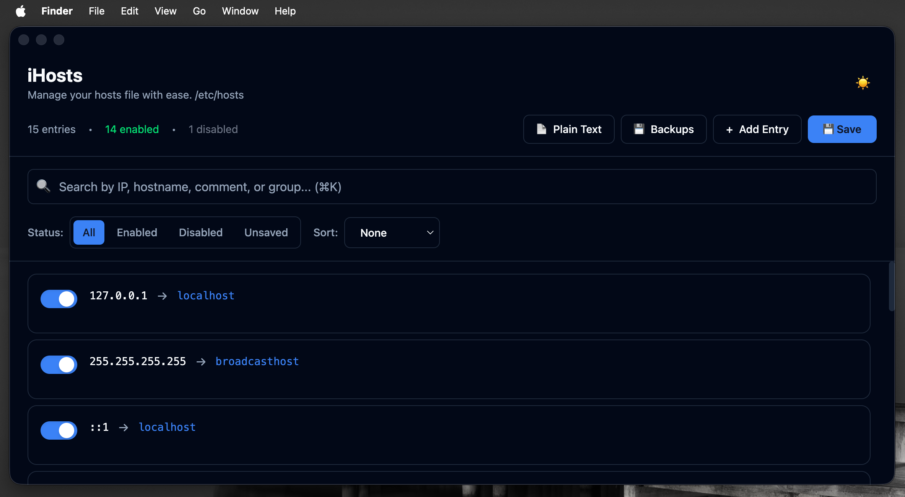

# iHosts

A modern, elegant macOS Electron application for managing the `/etc/hosts` file with a beautiful, user-friendly interface.


## Screenshot



## ✨ Features

### Core Functionality

- **📝 Hosts File Management**
  - Read and parse `/etc/hosts` file automatically
  - Write updates safely with automatic backups
  - Auto-reload on external file changes
  - Validate entries before saving

- **✏️ Entry Management**
  - Add, edit, and delete host entries with ease
  - Enable/disable entries via toggle switch
  - Inline editing with real-time validation
  - Support for comments and grouping
  - Visual indicators for unsaved changes

- **🔍 Search & Filter**
  - Search by IP, hostname, comment, or group
  - Filter by status: All, Enabled, Disabled, or Unsaved
  - Sort by IP, hostname, or group
  - Keyboard shortcuts for quick navigation

- **💾 Backup & Recovery**
  - Automatic backup before every save
  - Manual backup creation
  - Version history with timestamps
  - Easy restore from backups
  - Side-by-side comparison with current hosts

- **📄 Plain Text View**
  - View hosts file as plain text
  - Copy to clipboard with one click
  - See exactly how entries will be saved

### User Experience

- 🎨 Modern, clean interface with macOS-native feel
- 🌓 Light & Dark mode support with system preference detection
- ✨ Smooth animations and transitions
- 📱 Responsive layout
- ⌨️ Keyboard shortcuts for power users
- 🔔 Toast notifications for user feedback

## 🚀 Download & Installation

### Download from GitHub Releases

1. **Go to the [Releases page](https://github.com/nasraldin/iHosts/releases)**

2. **Download the latest release**
   - For macOS: Download `iHosts-darwin-arm64-1.0.0.zip` for Apple Silicon
   - The file will be in your Downloads folder

3. **Install the application**

   ```bash
   # Extract the ZIP file
   unzip ~/Downloads/iHosts-darwin-arm64-1.0.0.zip

   # Move to Applications folder
   mv iHosts.app /Applications/
   ```

4. **First Launch**
   - Open iHosts from Applications
   - The app is code signed and notarized by Apple
   - If you see a security warning, right-click the app and select **"Open"**, then confirm

### System Requirements

- **macOS** 10.15 (Catalina) or later
- **Administrator access** (required to modify `/etc/hosts`)

## 📖 How to Use

### Getting Started

1. **Launch iHosts**
   - Open the app from Applications
   - The app will automatically load your current `/etc/hosts` file

2. **View Your Entries**
   - All host entries are displayed in a clean, organized list
   - Each entry shows IP address, hostnames, and status

### Managing Entries

#### Adding a New Entry

1. Click the **"Add Entry"** button (➕) in the header
2. Fill in the details:
   - **IP Address**: e.g., `127.0.0.1`
   - **Hostnames**: e.g., `example.test` (multiple hostnames separated by spaces)
   - **Comment** (optional): Add a description
   - **Group** (optional): Organize entries by category
3. The entry is added to your list (marked as unsaved)

#### Editing an Entry

1. Hover over an entry card
2. Click the **Edit** icon (✏️)
3. Modify the fields as needed
4. Press `Esc` to cancel or `Cmd+Enter` to save changes

#### Enabling/Disabling Entries

- Click the toggle switch on any entry
- Disabled entries are shown with a comment marker
- Changes are marked as unsaved until you save

#### Deleting an Entry

1. Hover over an entry card
2. Click the **Delete** icon (🗑️)
3. Confirm the deletion

### Saving Changes

1. Make your changes in the UI
2. Review the **unsaved count** badge in the header
3. Click **"Save to /etc/hosts"** button
4. Enter your **administrator password** when prompted (macOS system dialog)
5. Changes are automatically backed up before writing
6. A success notification confirms the save

> ⚠️ **Important**: Always review your changes before saving. The app creates automatic backups, but it's good practice to verify your entries.

### Searching and Filtering

#### Search

- Use the search bar at the top
- Search by IP address, hostname, comment, or group
- Press `⌘K` (or `Ctrl+K`) to quickly focus the search

#### Filter by Status

- **All**: Show all entries
- **Enabled**: Show only enabled entries
- **Disabled**: Show only disabled entries
- **Unsaved**: Show only entries with unsaved changes

#### Sort

- Sort by: IP, Hostname, Group, or None
- Toggle ascending/descending order

### Viewing Plain Text

1. Click **"View Plain Text"** button in the header
2. See exactly how your hosts file will look when saved
3. Click **"Copy"** to copy the entire content to clipboard
4. Click **"View Entries"** to return to the entry list

### Managing Backups

1. Click **"Backups"** button in the header
2. View all available backups with timestamps
3. **Restore a backup**:
   - Click on a backup to see a comparison
   - Click **"Restore"** to restore that backup
   - Confirm the restoration
4. **Delete a backup**:
   - Click the delete icon on any backup
   - Confirm deletion

### Keyboard Shortcuts

- `⌘K` / `Ctrl+K`: Focus search bar
- `Esc`: Cancel editing
- `⌘+Enter` / `Ctrl+Enter`: Save entry while editing
- `⌘S` / `Ctrl+S`: Save to hosts file (when available)

## 🔒 Security

iHosts is designed with security in mind:

- **✅ Never overwrites `/etc/hosts` without backup**
- **✅ Validates file format before save**
- **✅ Atomic writes** to prevent corruption
- **✅ Sandboxed renderer process** for security
- **✅ Strict IPC boundaries** between processes
- **✅ No plaintext password storage** - uses macOS system authentication
- **✅ Automatic backups** before every write operation

### Password Handling

- iHosts uses macOS's native password dialog
- Your password is **never stored** or transmitted
- Authentication is handled entirely by macOS
- The app only requests sudo access when saving changes

## 🛠️ Development

### Prerequisites

- **Node.js** 18+ and npm/pnpm
- **macOS** (for development)

### Setup

1. **Clone the repository**

   ```bash
   git clone https://github.com/nasraldin/iHosts.git
   cd iHosts
   ```

2. **Install dependencies**

   ```bash
   pnpm install
   # or
   npm install
   ```

3. **Start development server**
   ```bash
   pnpm start
   # or
   npm start
   ```

### Building

**Package the application:**

```bash
pnpm run package
```

**Create distributable packages:**

```bash
pnpm run make
```

The built application will be in the `out/` directory.

### Code Signing & Notarization

For distributing the app, you need to code sign and notarize it with Apple. This prevents the "damaged" error when users download the app.

#### Prerequisites

1. **Apple Developer Account** (paid membership required)
2. **Developer ID Application Certificate** (for code signing)
3. **App Store Connect API Key** (for notarization - recommended) OR App-specific password

#### Setting up GitHub Secrets

Add these secrets to your GitHub repository (Settings > Secrets and variables > Actions):

**For Code Signing:**
- `CSC_IDENTITY`: Your Developer ID certificate name (e.g., "Developer ID Application: Your Name (TEAM_ID)")
- `CSC_LINK`: Base64-encoded .p12 certificate file (export from Keychain Access)
- `CSC_KEY_PASSWORD`: Password for the .p12 certificate

**For Notarization (App Store Connect API Key - Recommended):**
- `APPLE_API_KEY`: Path to your .p8 API key file (or base64-encoded content)
- `APPLE_API_KEY_ID`: Your API key ID (10 characters)
- `APPLE_API_ISSUER`: Your issuer ID (UUID format)

**Alternative Notarization (App-specific Password):**
- `APPLE_ID`: Your Apple ID email
- `APPLE_APP_SPECIFIC_PASSWORD`: App-specific password from appleid.apple.com
- `APPLE_TEAM_ID`: Your team ID (10 characters)

#### Exporting Certificate for CI

1. Open **Keychain Access** on your Mac
2. Find your **Developer ID Application** certificate
3. Right-click and select **Export**
4. Choose **Personal Information Exchange (.p12)** format
5. Set a password
6. Convert to base64 for GitHub secret:
   ```bash
   base64 -i certificate.p12 | pbcopy
   ```
7. Paste into `CSC_LINK` secret

#### Local Development

For local builds with code signing, set environment variables:

```bash
export CSC_IDENTITY="Developer ID Application: Your Name (TEAM_ID)"
export APPLE_API_KEY="path/to/AuthKey_XXXXXXXXXX.p8"
export APPLE_API_KEY_ID="XXXXXXXXXX"
export APPLE_API_ISSUER="xxxxxxxx-xxxx-xxxx-xxxx-xxxxxxxxxxxx"
```

Then run:
```bash
pnpm run make
```

### Code Quality

**Run linter:**

```bash
pnpm run lint
```

**Format code:**

```bash
pnpm run format
```

## 🏗️ Architecture

### Project Structure

```
src/
├── main/              # Electron main process
│   ├── handlers/      # IPC handlers
│   └── services/      # Business logic services
│       ├── hostsFileManager.ts
│       ├── hostsParser.ts
│       ├── backupManager.ts
│       └── profileManager.ts
├── renderer/          # React renderer process
│   ├── components/    # UI components
│   └── store/         # Zustand state management
├── preload.ts         # Preload script (IPC bridge)
└── types/             # TypeScript type definitions
```

### Key Technologies

- **Electron**: Cross-platform desktop framework
- **React 19**: UI library
- **TypeScript**: Type safety
- **Tailwind CSS v4**: Styling
- **Zustand**: State management
- **Vite**: Build tool

## 🐛 Troubleshooting

### Permission Denied

If you get permission errors when saving:

1. Make sure you're entering the correct administrator password
2. Check that the app has necessary permissions in **System Preferences > Security & Privacy**
3. Try restarting the app

### Hosts File Not Loading

If the hosts file doesn't load:

1. Check that `/etc/hosts` exists and is readable
2. Try restarting the app
3. Check the console for error messages (View > Developer > Show Console)

### Changes Not Applied

If changes aren't taking effect:

1. Make sure you clicked **"Save to /etc/hosts"** and entered your password
2. Check that entries are **enabled** (toggle switch is on)
3. Flush DNS cache:
   ```bash
   sudo dscacheutil -flushcache
   sudo killall -HUP mDNSResponder
   ```

### App Won't Open

If macOS blocks the app:

1. Right-click the app and select **"Open"**, then confirm in the dialog
2. If that doesn't work, go to **System Settings > Privacy & Security**
3. Scroll down and look for a message about iHosts being blocked
4. Click **"Open Anyway"** if available
5. If you downloaded from GitHub Releases, ensure you're using the official release (code signed and notarized)

## 📝 License

MIT License - see [LICENSE](LICENSE) file for details

## 👤 Author

**Nasr Aldin**

- GitHub: [@nasraldin](https://github.com/nasraldin)

## 🙏 Acknowledgments

- Built with [Electron](https://www.electronjs.org/)
- UI powered by [React](https://react.dev/) and [Tailwind CSS](https://tailwindcss.com/)
- Icons and design inspired by macOS native applications

## 📄 Changelog

### Version 1.0.0

- Initial release
- Hosts file management
- Entry CRUD operations
- Search and filtering
- Backup and restore
- Plain text view
- Dark mode support
- Keyboard shortcuts

---

**Made with ❤️ for macOS users**
